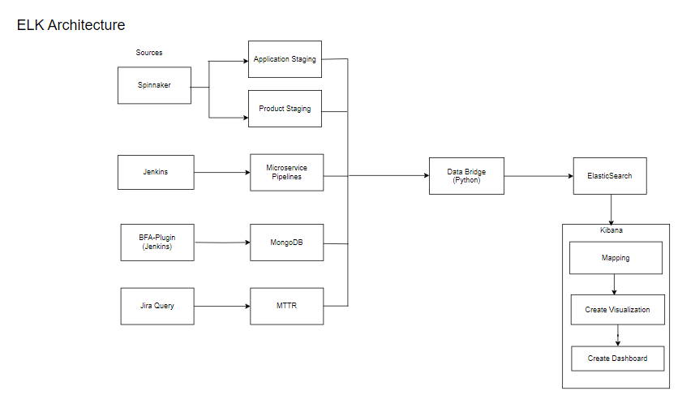

# oss-release-io-solution

[TOC]

## Introduction

-----------

The oss-release-io-solution repository is an open-source project that provides a solution for integrating the Elastic Stack (ELK) with various data sources using source operators and other configurations file. The Elastic Stack, commonly known as ELK, is a powerful set of tools that enables the collection, storage, analysis, and visualization of data from diverse sources.

- Elastic Search is a robust search and analytics tool that stores data in a document oriented data store. It is open source, You can download, use and modify the program free of charge.

## Architecture

## Directory Structure Overview

The directory structure in detail explains the each step included in it. and also explains the subdirectories also.

- Oris/: This folder likely contains project-specific resources, configurations, or code related to the Oris component of our project.
    - elk/: The "elk" folder may contain configurations, scripts, or other resources related to Elasticsearch, data, and Kibana.
        - src/: contains the source code for the project. Inside this folder, typically find subdirectories and files that contain the actual code
            - etc/: This is a directory structure within the 'elk' project, possibly organizing various utilities related code. This utility functions or modules that perform common tasks or provide reusable functionality.
                - EFK_deployment_files/: contains efk deployment files and configuration files.
            - operators/: It contains the python files.They are used to automate and manage the deployment and scaling of applications.
                - lib/: The "lib" folder often contains libraries or shared code that is used across different parts of our project. This could include utility functions, common modules, or dependencies that are used throughout your codebase.

The [OSS Release IO Solution repo](https://gerrit-gamma.gic.ericsson.se/plugins/gitiles/OSS/com.ericsson.oss.cicd/oss-release-io-solution/+/refs/heads/master/) is a central repository. This allows teams to easily manage and ensures that they are stored in a consistent and organized manner.

## Deployment of EFK Throgh ECK
- ECK manages the deployment and lifecycle of Elasticsearch, Kibana and Filebeat.
- Filebeat collects data from files and sends it to Elasticsearch.
- Kibana visualizes the data in Elasticsearch.
EFK Deployment files can be found on below repo.

[EFK Deployment files](https://gerrit-gamma.gic.ericsson.se/plugins/gitiles/OSS/com.ericsson.oss.cicd/oss-release-io-solution/+/refs/heads/AEAT-546/oris/elk/src/etc/config/EFK_deployment_files)

This document serves as a comprehensive guide to understanding and using the oss-release-io-solution repository. It covers the key components, their functionalities, and how to effectively leverage them for your data integration needs.
