# Generating SSL certificate

## Creation of SSL certificate, using new CLM updating in to cluster

The following below steps that was employed to generate a Ericsson Internal certificates using new Ericsson CLM portal.
### Access new CLM portal

URL: Venafi Trust Protection Platform (ericsson.com)
### Create the new Internal certificate

Click on Create a New Certificate
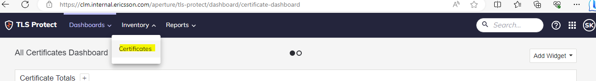
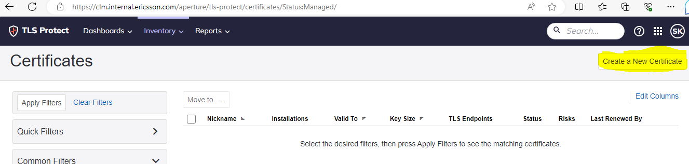
#### Tab 1 : Provide folder details

Select "Policy \ Internal Trust \ Standard " option
Provide a Nickname for the certificates that is to be generated
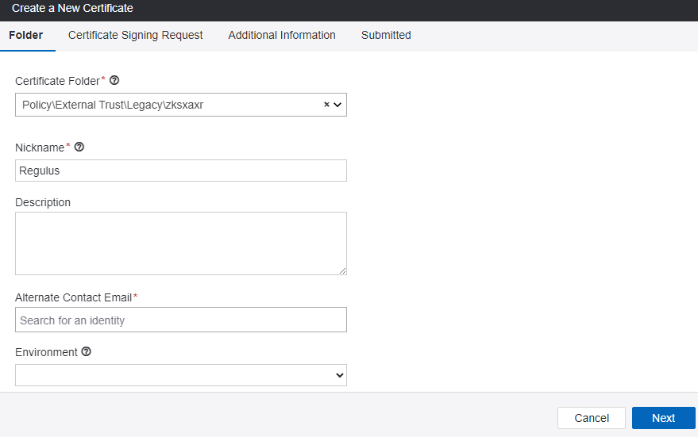

Scroll down,

Enter the Contact details

Provide the Alternate Contact Email - The Ericsson DL of your team

Provide the Service Name - Hostname indicative of the service

Environment : Test
#### Tab 2: Certificate Signing Request

Provide the CSR content
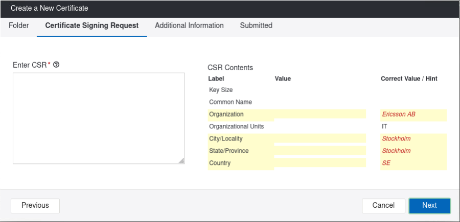

##### Generate the CSR content

CSR file content required, hence create the config file and generate the .csr and .key file using the openssl command.
Create the configuration file detailing out all the required fields.

```
iam.conf

[req]
default_bits = 2048
distinguished_name = dn
x509_extensions = v3_req
prompt = no
Default_md = sha256
[dn]
C = SE
ST = Stockholm
L = Stockholm
O = Ericsson AB
OU = IT
CN = kibana.hahn130.rnd.gic.ericsson.se
[v3_req]
keyUsage = nonRepudiation, digitalSignature, keyEncipherment
extendedKeyUsage = serverAuth
subjectAltName = @alt_names
[alt_names]
DNS = kibana.hahn130.rnd.gic.ericsson.se

```
CSR file content required, hence create the config file and generate the .csr and .key file using the openssl command.
Create the configuration file detailing out all the required fields.

##### Create the .CSR and .key files using openssl command

Command to generate .CSR and .key file
```
openssl req -new -newkey rsa:4096 -keyout kibana.hahn130.rnd.gic.ericsson.se.key -out kibana.hahn130.rnd.gic.ericsson.se.csr -nodes -config iam.conf

```
Copy and Paste the content of the .csr file

cat kibana.hahn130.rnd.gic.ericsson.se.csr
```
-----BEGIN CERTIFICATE REQUEST-----
MIIEvzCCAqcCAQAwejELMAkGA1UEBhMCU0UxEjAQBgNVBAgMCVN0b2NraG9sbTES
MBAGA1UEBwwJU3RvY2tob2xtMRQwEgYDVQQKDAtFcmljc3NvbiBBQjELMAkGA1UE
CwwCSVQxIDAeBgNVBAMMF21hdC5ld3MuZ2ljLmVyaWNzc29uLnNlMIICIjANBgkq
hkiG9w0BAQEFAAOCAg8AMIICCgKCAgEAy3Itz6qhmZdmEvknvudfyawLyMmnOQL/
vxU7DBSfx38vlWfd8vp0ZZtUaSjOqY2BzFMD2QB8ICGOY3Rj8W1adSCvb0dR3xjn
Ut7coWwySFD/rqiFRTbz03NFc/B0U1cnco6P7UcgzdfFUHJODcdFntrfgIm8xPQe
yJL0KGgkePmsFAbYf1LoMJjNR8bUxbPLCgRurLjDdlBV/q5/fHYRYmU/FElWNDBU
2sfMX/q25/1RL1czXO29bB6tYjLYYgzTS89W3kUVULikuXyjcV90xNZWe/xsImh3
MF4aEk6T/xs0/rpRNjJdEzq6zPR+uVD80GXv6hCt9UTZgaTaUbc9cNCxEriOlVJu
KCYZ9XFW1xc4Kw8UsT3gp8u3cB/SJK8IfNYv9MKnqmCaNg9fImI2Ok6c0eqUW8iB
IjUpwf2kV/8QCeEYla6YZiUjqr9fzhhyBSwP2Oc8TX1nlVD71b4hMoKzLlqM9FnR
omUNMBK5uQ8NGh1l9SoDnEvyXVqLA3ftYe/C3fhYswDrJe42TlFrTioriQ/A7KMw
Lllh/PQn5adDQIx/t7k1HNtfkq55UmSKPxbL0zXzou9pdjV5LkGO35/OjUOazjUq
2OUBe8y1o5eSE3t9xvzqu8cjbPoYJoopUJUED+oJLW66TufW3vexkm7m4z/WUIgP
DbFEQWrnZrECAwEAAaAAMA0GCSqGSIb3DQEBCwUAA4ICAQC0LVh5d96LMvovz0gP
D7MmPxFeK1Px+nzyJXj6ArfKgWAu+QYdrZBHxWDQI/mQ8jnyPoJBEl54knIk+iAp
UoUDjvNMKCaoZ05Hj3SVx1uqjoBSvkGbn4tojCdP82FPvU62p7Jxs/k8q7ZTdRug
E+4xUxo5zeO3EdZ9GbeP/hpIpKQGIigLJ/NuOLzCivKzzc6g2Pxl3WCEikjQZQXp
/wxcy6An9KFk+iPvL66NiJNydlU1XO8YM788kbdWqNmToYialIpSmuYLHqPl7pPF
47TDGoEhx8yGDU/OKFkaTplnxNtx/C02jmeYlAmpwsqvDAHQY6ZbaAPjZ7R8Eoby
rTy3IJTAEUTAiMijSEjV7tuHVmWyJrmMgNzos+xfaMDT35y67pxt3sVxFILqvYye
/I1KPcjFZOXTJN3jaltZUw5IKw==
-----END CERTIFICATE REQUEST-----
```

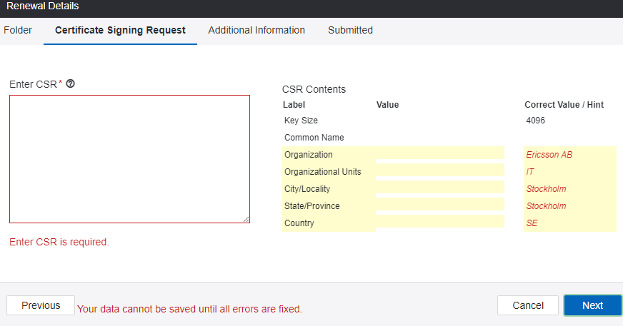

Paste the content in the Enter CSR textarea.

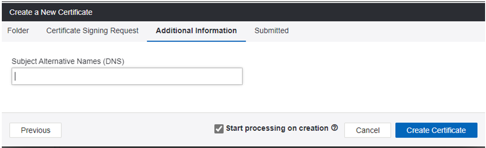

Press Next and Proceed to generating the certificate

##### Tab 3: Additional Information

Enter the Subject Alternative Name(DNS) detail
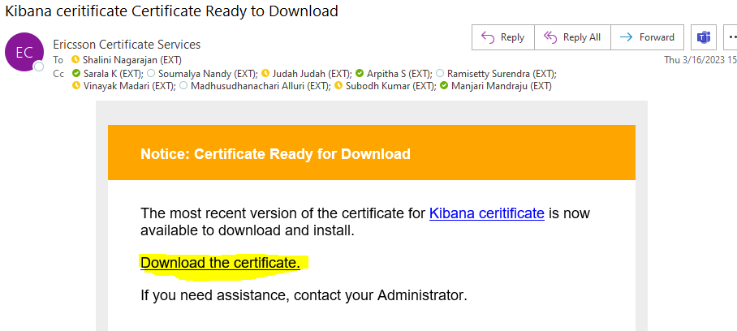

Click on Create Certificate

The Certificates with the CA certs will be shared in the provided contact details, as given below.
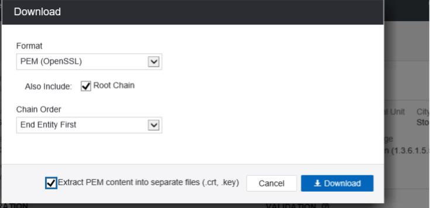

#### Download the certificates


#### Updating certificates to cluster

Downloaded certificates will be zipped folder format.
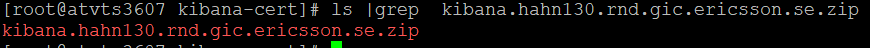
Unzip the folder by using the below command
```
unzip kibana.hahn130.rnd.gic.ericsson.se.zip
```
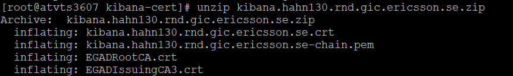
After unzip, below are the files it contains.

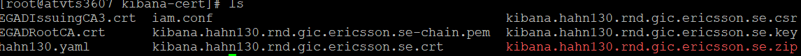

Now we have to create the secrets in the kubernetes cluster of the namespace by using the below command.

```
kubectl create secret tls elk --cert=kibana.hahn130.rnd.gic.ericsson.se.crt --key=kibana.hahn130.rnd.gic.ericsson.se.key -n namespacename

```

## Renew the ssl certificate through CLM portal

SSL Certificate renewal using the ClM portal.
Access  the CLM portal using below link.

URL: Venafi Trust Protection Platform (ericsson.com)

list the certficates on CLM portal,choose required the certificate and select on download drop down list click the renew option.

Edit and renew certificate, Regeneretage csr file

Command to regenerate .CSR and .key file

```
openssl req -new -newkey rsa:4096 -keyout kibana.hahn130.rnd.gic.ericsson.se.key -out kibana.hahn130.rnd.gic.ericsson.se.csr -nodes -config iam.conf

```
Copy and Paste the content of the .csr file

cat kibana.hahn130.rnd.gic.ericsson.se.csr
```
-----BEGIN CERTIFICATE REQUEST-----
MIIEvzCCAqcCAQAwejELMAkGA1UEBhMCU0UxEjAQBgNVBAgMCVN0b2NraG9sbTES
MBAGA1UEBwwJU3RvY2tob2xtMRQwEgYDVQQKDAtFcmljc3NvbiBBQjELMAkGA1UE
CwwCSVQxIDAeBgNVBAMMF21hdC5ld3MuZ2ljLmVyaWNzc29uLnNlMIICIjANBgkq
hkiG9w0BAQEFAAOCAg8AMIICCgKCAgEAy3Itz6qhmZdmEvknvudfyawLyMmnOQL/
vxU7DBSfx38vlWfd8vp0ZZtUaSjOqY2BzFMD2QB8ICGOY3Rj8W1adSCvb0dR3xjn
Ut7coWwySFD/rqiFRTbz03NFc/B0U1cnco6P7UcgzdfFUHJODcdFntrfgIm8xPQe
yJL0KGgkePmsFAbYf1LoMJjNR8bUxbPLCgRurLjDdlBV/q5/fHYRYmU/FElWNDBU
2sfMX/q25/1RL1czXO29bB6tYjLYYgzTS89W3kUVULikuXyjcV90xNZWe/xsImh3
MF4aEk6T/xs0/rpRNjJdEzq6zPR+uVD80GXv6hCt9UTZgaTaUbc9cNCxEriOlVJu
KCYZ9XFW1xc4Kw8UsT3gp8u3cB/SJK8IfNYv9MKnqmCaNg9fImI2Ok6c0eqUW8iB
IjUpwf2kV/8QCeEYla6YZiUjqr9fzhhyBSwP2Oc8TX1nlVD71b4hMoKzLlqM9FnR
omUNMBK5uQ8NGh1l9SoDnEvyXVqLA3ftYe/C3fhYswDrJe42TlFrTioriQ/A7KMw
Lllh/PQn5adDQIx/t7k1HNtfkq55UmSKPxbL0zXzou9pdjV5LkGO35/OjUOazjUq
2OUBe8y1o5eSE3t9xvzqu8cjbPoYJoopUJUED+oJLW66TufW3vexkm7m4z/WUIgP
DbFEQWrnZrECAwEAAaAAMA0GCSqGSIb3DQEBCwUAA4ICAQC0LVh5d96LMvovz0gP
D7MmPxFeK1Px+nzyJXj6ArfKgWAu+QYdrZBHxWDQI/mQ8jnyPoJBEl54knIk+iAp
UoUDjvNMKCaoZ05Hj3SVx1uqjoBSvkGbn4tojCdP82FPvU62p7Jxs/k8q7ZTdRug
E+4xUxo5zeO3EdZ9GbeP/hpIpKQGIigLJ/NuOLzCivKzzc6g2Pxl3WCEikjQZQXp
/wxcy6An9KFk+iPvL66NiJNydlU1XO8YM788kbdWqNmToYialIpSmuYLHqPl7pPF
47TDGoEhx8yGDU/OKFkaTplnxNtx/C02jmeYlAmpwsqvDAHQY6ZbaAPjZ7R8Eoby
rTy3IJTAEUTAiMijSEjV7tuHVmWyJrmMgNzos+xfaMDT35y67pxt3sVxFILqvYye
/I1KPcjFZOXTJN3jaltZUw5IKw==
-----END CERTIFICATE REQUEST-----
```
Paste the content in the Enter CSR textarea.


Press Next and Proceed to generating the certificate.

##### Additional Information

Enter the Subject Alternative Name(DNS) detail


Click on Create Certificate

The Certificates with the CA certs will be shared in the provided contact details, as given below.


#### Download the certificates


unzip the certificate and create secret in the kubernetes cluster of the namespace by using the below command.


```
kubectl create secret tls elk --cert=kibana.hahn130.rnd.gic.ericsson.se.crt --key=kibana.hahn130.rnd.gic.ericsson.se.key -n <namespacename>

```
